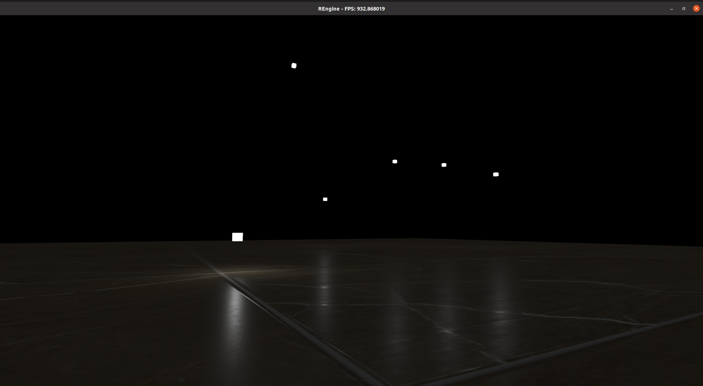
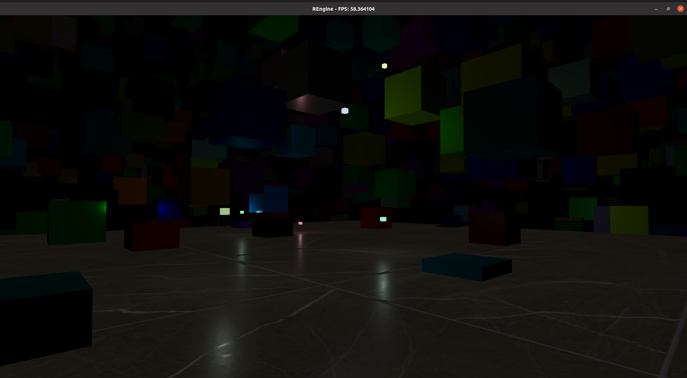
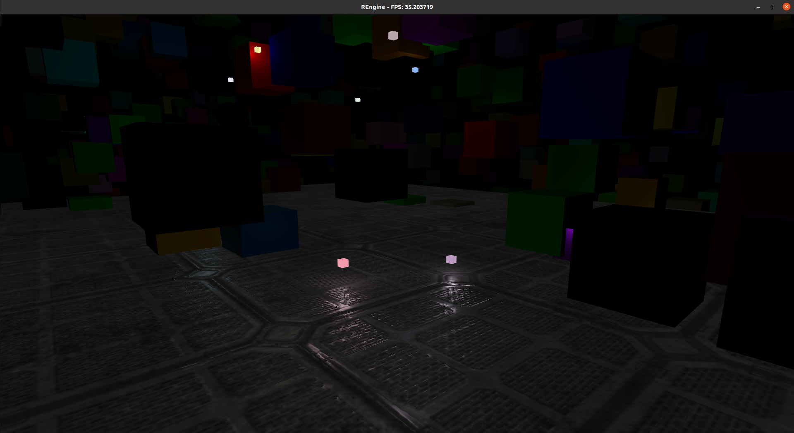
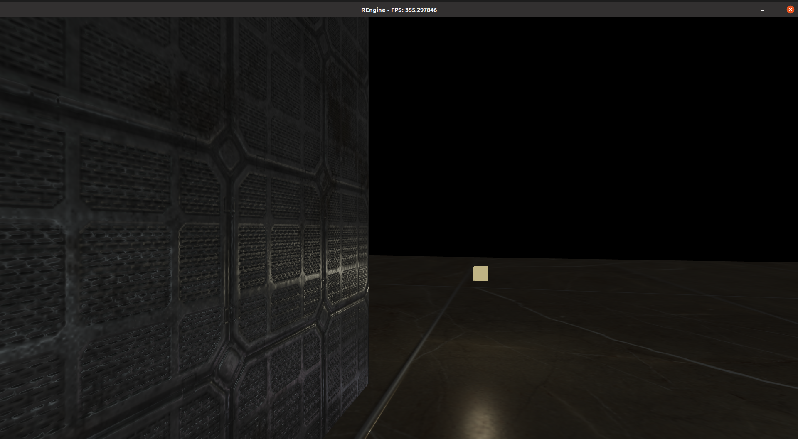

# RainstormFramework

## Description
Rainstorm Framework is a game engine based on OpenGL and uses an Object Component system. The ultimate goal of this engine is to provide a GUI-free but simple-to-use code interface.

## Demo





## Usage
### main interface
```c++
#include "REngine.h"

class App : public Engine {
    ...
   public:
    // calls before the game loop
    bool onCreate() override {
        ...
        return true;
    }

    // calls every frame 
    // for updating game logic
    bool onUpdate(double deltaTime) override {
        ...
        return true;
    }

    // calls every frame
    // for rendering game objects
    bool onRender(double deltaTime) override {
        ...
        return true;
    }
};


int main() {
    App app;
    if (app.initialize()) {
        app.run();
    }

    return 0;
}
```
### Object Component system
```c++
// create an object:
// addObject requires two parameters:
//     a string for object name
//     an unsigned integer for layer index
Object* object = manager->addObject("ObjectName", 0);

// add a component
object->addComponent<ComponentType>(parameters ...);
// built-in ComponentTypes:
//     Transform, Camera, Control, Light, Material, Mesh

// get access to a ComponentType
ComponentType* component = object->getComponent<ComponentType>();

// create your own ComponentType
class ComponentType : public Component {
    ...
   public:
    ComponentType() { ... }
    ~ComponentType() override { ... }

    // for initializing the component
    // calls after all components of the object are constructed
    //     but before the game loop
    void initialize() override { ... }

    // calls every frame for updating game logic
    void update(double deltaTime) override { ... }

    // calls every frame for rendering purpose
    void render(double deltaTime) override { ... }
};

// update an object
object->update(deltaTime);

// render an object
object->render(deltaTime);

// destroy an object
object->destroy()

// get access to an object
Object* object = manager->getObjectByName("ObjectName");

// update objects
// it updates all objects layer by layer starting from layer 0
manager->update(deltaTime);
// or by specific layer
manager->updateByLayer(deltaTime, layerIndex);

// render objects
// it renders all objects layer by layer starting from layer 0
manager->render(deltaTime);
// or by specific layer
manager->renderByLayer(deltaTime, layerIndex);
```
### Debug
when the c++ macro `NDEBUG` is not set, debugging messages will be output to standard error

`STATIC_ASSERT(expr)` assert expr at compile-time

`ASSERT(expr)` assert expr at run-time

`DEBUG_ADD_DEPTH()` add one level more indentation for displaying

`DEBUG_DEC_DEPTH()` decrease one level of indentation

`DEBUG_MSG(expr)` put expr to standard error

`DEBUG_LINE()` put a horizontal line to standard error

`DEBUG_ERROR(expr)` put expr to standard error

## File structure
```
.
├── assets
│   ├── shaders
│   └── textures
├── CMakeLists.txt
├── config
│   └── settings.cfg
├── README.md
└── src
    ├── components
    ├── core
    │   ├── containers
    │   ├── engine.cpp
    │   ├── engine.h
    │   ├── OCcore
    │   └── systems
    ├── debug
    ├── error
    ├── math
    ├── REngine.h
    ├── thirdParty
    │   └── stb_image
    └── utilities
```
## Prerequisites
cmake; OpenGL 3.3
## Build
```
cmake . && make
```
## Author
Daniel Hongyu Ding
## Notes
### Features Done
- core engine
- Object Component system
- mesh rendering
- PBR texture
### Future Features
- model importing
- shadow support
- GUI
- multithreading optimization
- Object Component optimization
- Crossplatform: Windows
